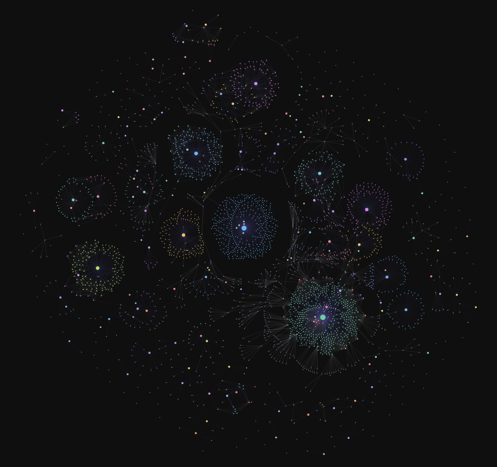

# Notion Graph View

Notion 워크스페이스의 데이터베이스와 페이지 관계를 옵시디언 스타일의 포스 그래프로 시각화하는 Chrome / Naver Whale 확장앱입니다.




## 주요 기능

- **관계 그래프**: DB 내 페이지들의 관계형(Relation) 속성을 엣지로 시각화
- **로컬 그래프**: 현재 열려있는 노션 페이지 중심의 서브그래프 보기 (깊이 1~3)
- **검색**: 페이지 이름으로 노드 검색 및 포커스
- **DB 필터**: DB별 표시/숨기기, 전체 선택/취소
- **그래프 설정**: 노드 크기, 링크 두께, 반발력, 링크 거리 등 실시간 조정
- **캐시**: 빠른 로딩을 위한 stale-while-revalidate 캐시
- **노드 클릭**: 현재 탭을 해당 노션 페이지로 이동

## 설치 방법

### 개발자 모드 로드 (Chrome / Whale)

1. 이 저장소를 클론합니다.
   ```bash
   git clone https://github.com/hymmni/notion-graph-view.git
   ```
2. Chrome: `chrome://extensions` / Whale: `whale://extensions` 접속
3. 우측 상단 **개발자 모드** 활성화
4. **압축해제된 확장 프로그램을 로드합니다** 클릭 → 클론한 폴더 선택

### 업데이트

```bash
git pull
```
이후 확장앱 관리 페이지에서 새로고침(↺) 버튼 클릭

## 사용 방법

1. [Notion Integration](https://www.notion.so/my-integrations) 페이지에서 Internal Integration 생성
2. 토큰(`ntn_` 또는 `secret_` 로 시작)을 복사
3. 확장앱 아이콘 클릭 → 토큰 입력 후 **연결하기**
4. 그래프가 로드되면 드래그·줌·검색으로 탐색

> **주의**: Integration이 접근할 수 있는 DB에만 그래프가 표시됩니다.  
> Notion에서 각 DB → **연결(Connect)** 메뉴에서 Integration을 추가해야 합니다.

## 기술 스택

- Manifest V3
- D3.js v7 (로컬 번들)
- Notion API `2022-06-28`
- `chrome.sidePanel` API

## 라이선스

MIT
